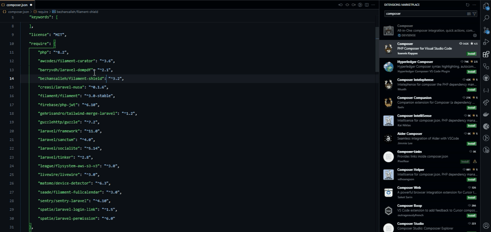

# Kaesa Laravel Extension Pack

Berupa catatan _history_ ekstension apa saja yang saya gunakan untuk project laravel.

## Ekstensi Wajib Laravel

### [Laravel Official VS Code Extension](https://marketplace.visualstudio.com/items?itemName=laravel.vscode-laravel)

Ini ekstensi official buatan core tim laravel. Jadi pakai untuk menggantikan peran extension ini:

- [Laravel Blade Snippets](https://marketplace.visualstudio.com/items?itemName=onecentlin.laravel-blade)  
  Ternyata tanpa ini tidak muncul `Emmet` html di blade template jadi masih butuh ini.
- [Laravel Snippets](https://marketplace.visualstudio.com/items?itemName=onecentlin.laravel5-snippets)
- [~~Laravel goto view~~](https://marketplace.visualstudio.com/items?itemName=codingyu.laravel-goto-view)
- [~~laravel-jump-controller~~](https://marketplace.visualstudio.com/items?itemName=pgl.laravel-jump-controller)
- [Laravel Extra Intellisense](https://marketplace.visualstudio.com/items?itemName=amiralizadeh9480.laravel-extra-intellisense)  
  Belum tahu apa saja yang kubutuhkan untuk ekstensi ini jadi saya disabled.
- [~~Laravel-goto-components~~](https://marketplace.visualstudio.com/items?itemName=naoray.laravel-goto-components)
- [~~Laravel Blade formatter~~](https://marketplace.visualstudio.com/items?itemName=shufo.vscode-blade-formatter)
  Mungkin beberapa snippets masih berguna. Tapi saya disabled.
- [~~Laravel Create View~~](https://marketplace.visualstudio.com/items?itemName=glitchbl.laravel-create-view)

### [Laravel Blade Spacer](https://marketplace.visualstudio.com/items?itemName=austenc.laravel-blade-spacer)

### [Laravel Blade Wrapper](https://marketplace.visualstudio.com/items?itemName=IHunte.laravel-blade-wrapper)

Digunakan untuk wrap tag html dengan blade directive. Command `CTRL + SHIFT + T`.

### [DevDb](https://marketplace.visualstudio.com/items?itemName=damms005.devdb)

Ekstensi ini digunakan untuk menampilkan data yang ada di database, sayang-nya untuk `PostgreSQL` tidak bisa edit/delete data-nya. Untuk pengguna `MySQL` bisa untuk edit/delete data atau record-nya.

### [Tailwind CSS IntelliSense](https://marketplace.visualstudio.com/items?itemName=bradlc.vscode-tailwindcss)

Yeah, karena laravel sekarang default skeleton-nya atau Starter Kit-nya menggunakan Tailwind CSS jadi ini saya butuhkan.

### [EditorConfig for VS Code](https://marketplace.visualstudio.com/items?itemName=EditorConfig.EditorConfig)

Digunakan untuk kolaborasi supaya style kode-nya sama antar programmer.

### [Better Pest](https://marketplace.visualstudio.com/items?itemName=m1guelpf.better-pest)

- Butuh eksplore lebih lanjut, saya belum paham.

Ini digunakan untuk testing.

### [PHP Intelephense](https://marketplace.visualstudio.com/items?itemName=bmewburn.vscode-intelephense-client)

Karena laravel menggunakan PHP, jadi ini dibutuhkan.

### [PHP Debug](https://marketplace.visualstudio.com/items?itemName=xdebug.php-debug)

- Butuh eksplore lebih lanjut, saya belum paham.

Saya kurang tahu cara menggunakan ini, mungkin untuk meminimalisir debuging dengan `dd()`, `dump()`.

### [PHP Namespace Resolver](https://marketplace.visualstudio.com/items?itemName=MehediDracula.php-namespace-resolver)

Saya gunakan untuk import dan expand php namespace.

### [PHP IntelliSense](https://marketplace.visualstudio.com/items?itemName=zobo.php-intellisense)

-

### [Composer](https://marketplace.visualstudio.com/items?itemName=DEVSENSE.composer-php-vscode)

- Terdapat command `CTRL` + `SHIFT` + `P` lalu ketik `Composer`.
- Dapat melihat versi yang sedang dipakai serta ada sugestion `CTRL` + `SPACE`.  
  

Dan mungkin masih banyak lagi silahkan cek penjelasannya di README extensions tersebut.

---

## Ekstensi Wajib untuk HTML, CSS, Javascript

### [Auto Close Tag](https://marketplace.visualstudio.com/items?itemName=formulahendry.auto-close-tag)

### [Auto Rename Tag](https://marketplace.visualstudio.com/items?itemName=formulahendry.auto-rename-tag)

Supaya bisa rename (ganti nama) tag html. Jadi saat rename tag pembuka, tag penutupnya juga auto ke-rename.

### [HTML CSS Support](https://marketplace.visualstudio.com/items?itemName=ecmel.vscode-html-css)

CSS Intellisense for HTML

### [IntelliSense for CSS class names in HTML](https://marketplace.visualstudio.com/items?itemName=Zignd.html-css-class-completion)

CSS Intellisense for HTML

### [Multiple cursor case preserve](https://marketplace.visualstudio.com/items?itemName=Cardinal90.multi-cursor-case-preserve)

Ini saya gunakan supaya case tidak berubah saat edting dengan multiple cursor `CTRL + D` atau `ALT + RIGHT MOUSE CLICK`.

### [Node.js Modules Intellisense](https://marketplace.visualstudio.com/items?itemName=leizongmin.node-module-intellisense)

Ini digunakan untuk import module nodejs.

### [ESLint](https://marketplace.visualstudio.com/items?itemName=dbaeumer.vscode-eslint)

Linter untuk javascript.

### [JavaScript (ES6 code snippets)](https://marketplace.visualstudio.com/items?itemName=xabikos.JavaScriptSnippets)

### Opsional: [JavaScript and TypeScript Nightly](https://marketplace.visualstudio.com/items?itemName=ms-vscode.vscode-typescript-next)

Pasang jika butuh TypeScript.

---

## Ekstensi Opsional Laravel

### Opsional: [Inline fold](https://marketplace.visualstudio.com/items?itemName=moalamri.inline-fold)

Biasanya saya gunakan untuk menyebunyikan class TailwindCSS supaya mudah dibaca tag htmlnya.

### Opsional: [Pest Snippets](https://marketplace.visualstudio.com/items?itemName=dansysanalyst.pest-snippets)

Dapat dilihat ini snippets untuk testing laravel dengan `Pest`.

### Opsional: [IntelliPHP - AI Autocomplete for PHP](https://marketplace.visualstudio.com/items?itemName=DEVSENSE.intelli-php-vscode)

### Opsional: [PHP](https://marketplace.visualstudio.com/items?itemName=DEVSENSE.phptools-vscode)

### Opsional: [PHP Profiler](https://marketplace.visualstudio.com/items?itemName=DEVSENSE.profiler-php-vscode)

### Opsional [Laravel Artisan](https://marketplace.visualstudio.com/items?itemName=ryannaddy.laravel-artisan)

Cara pakai `CTRL` + `SHIFT` + `P` lalu ketik `Artisan`.

---

## Laravel Livewire Stater Kit

- [Alpine.js IntelliSense by P. C. Bowers](https://marketplace.visualstudio.com/items?itemName=pcbowers.alpine-intellisense)  
  Ekstensi ini berfungsi sebagai:

  - IntelliSense
  - Snipptes
  - Syntax Highlight

  Extension ini gabungan antara dua ekstensi:

  - [adrianwilczynski/Alpine.js IntelliSense](https://marketplace.visualstudio.com/items?itemName=adrianwilczynski.alpine-js-intellisense)
  - [Alpine.js Sytax Highlight](https://marketplace.visualstudio.com/items?itemName=sperovita.alpinejs-syntax-highlight)

  Saya sudah uji coba, bagusnya punya `P. C. Bowers` karena snippets-nya banyak.

- [Livewire Language Support](https://marketplace.visualstudio.com/items?itemName=cierra.livewire-vscode)  
  Jika anda menggunakan livewire wajib install ekstensi ini.

## Laravel Vue Stater Kit

- [Vue](https://marketplace.visualstudio.com/items?itemName=znck.vue)  
  Syntax Highlight untuk Vue
- [Vue - Official](https://marketplace.visualstudio.com/items?itemName=Vue.volar)
- [Vue 3 Snippets](https://marketplace.visualstudio.com/items?itemName=hollowtree.vue-snippets)

## Laravel React Stater Kit

- [ES7+ React/Redux/React-Native snippets](https://marketplace.visualstudio.com/items?itemName=dsznajder.es7-react-js-snippets)

---

## Opsional Ekstensi lainnya

Dibawah ini ekstensi yang saya pakai.

- P1: Sering saya gunakan.
- P2: Kadang-kadang saya gunakan.
- P3: Jarang saya gunakan.
- P4: DEPRECATED alias sudah tidak direkomendasikan digunakan.

Daftar Ekstensi:

- [P1: GitHub Theme](https://marketplace.visualstudio.com/items?itemName=GitHub.github-vscode-theme)  
  Supaya terbiasa dengan tampilan github saja, saat debug langsung lewat github.
- [P1: Material Icon Theme](https://marketplace.visualstudio.com/items?itemName=PKief.material-icon-theme)
  Saya suka icon-nya.

  - [~~P4: VSCode Gread Icons~~](https://marketplace.visualstudio.com/items?itemName=emmanuelbeziat.vscode-great-icons)  
    Uninstalled, karena saya sudah tidak pakai ini lagi.
  - [~~vscode-icons~~](https://marketplace.visualstudio.com/items?itemName=vscode-icons-team.vscode-icons)  
    Uninstalled, karena saya sudah tidak pakai ini lagi.

- [P1: Postman](https://marketplace.visualstudio.com/items?itemName=Postman.postman-for-vscode)  
  Buat testing API yang saya buat tanpa harus buka aplikasi postman.

  - [P4: REST Client](https://marketplace.visualstudio.com/items?itemName=humao.rest-client)  
    Alternatif dari Postman.

- [P1: Markdown Shortcuts](https://marketplace.visualstudio.com/items?itemName=mdickin.markdown-shortcuts)  
  Yeah biar bisa pakai shortcut keyboard saat menulis file markdown, misal `CTRL + B` untuk bold/tebal, dbs.
- [P1: GitHub Markdown Preview](https://marketplace.visualstudio.com/items?itemName=bierner.github-markdown-preview)  
  Karna saya sering membaca markdown lewat github setidaknya saya ingin tampilan preview di VSCode sama dengan di Github.

  - [Markdown Preview Github Styling](https://marketplace.visualstudio.com/items?itemName=bierner.markdown-preview-github-styles)
  - [Markdown Checkboxes](https://marketplace.visualstudio.com/items?itemName=bierner.markdown-checkbox)
  - [Markdown Emoji](https://marketplace.visualstudio.com/items?itemName=bierner.markdown-emoji)
  - [Markdown Footnotes](https://marketplace.visualstudio.com/items?itemName=bierner.markdown-footnotes)
  - [Markdown yaml Preamble](https://marketplace.visualstudio.com/items?itemName=bierner.markdown-yaml-preamble)
  - [Markdown Preview Mermaid Support](https://marketplace.visualstudio.com/items?itemName=bierner.markdown-mermaid)

- [P1: Prettier - Code formatter](https://marketplace.visualstudio.com/items?itemName=esbenp.prettier-vscode)  
  Format kode supaya konsisten, tapi sepertinya sudah ada EditorConfig, saya kurang paham dah.
- [P1: Codeium](https://marketplace.visualstudio.com/items?itemName=Codeium.codeium)  
  Mirip dengan Github Copilot.

- [P1: Docker](https://marketplace.visualstudio.com/items?itemName=ms-azuretools.vscode-docker)

- [P1: GitHub Action](https://marketplace.visualstudio.com/items?itemName=github.vscode-github-actions)
- [P1: GitHub Pull Requests](https://marketplace.visualstudio.com/items?itemName=GitHub.vscode-pull-request-github)

- [P1: Live Share](https://marketplace.visualstudio.com/items?itemName=ms-vsliveshare.vsliveshare)  
  Ekstensi yang saya gunakan untuk ngoding bareng temen (peer programming). Untuk mempermudah dalam mengubah kode tanpa harus memberikan perintah suara ke temen saat share screen. Jadi saya langsung saja ngetik kodingannya langsung tanpa harus minta temen untuk ubah kodenya, saya sendiri yang ubah kodenya tapi source codenya ada di temen.

  - [P4: Live Share Audio](https://marketplace.visualstudio.com/items?itemName=MS-vsliveshare.vsliveshare-audio)  
    Ini sudah tidak digunakan lagi karena saya bisa memanfaatkan platform lain seperti `discord`, `zoom`, `google meet`, dll.

- [P2: Figma for VS Code](https://marketplace.visualstudio.com/items?itemName=figma.figma-vscode-extension)
- [P2: Live Preview](https://marketplace.visualstudio.com/items?itemName=ms-vscode.live-server)  
  Jarang saya pakai untuk project laravel.
- [P2: Live Server](https://marketplace.visualstudio.com/items?itemName=ritwickdey.LiveServer)  
  Mirip dengan Live Preview, seperti biasa saya jarang pakai untuk project laravel.

- [P3: Git History](https://marketplace.visualstudio.com/items?itemName=donjayamanne.githistory)
- [P3: GitLens](https://marketplace.visualstudio.com/items?itemName=eamodio.gitlens)

---

## P4: Ekstensi yang Saya Disabled atau Jarang Dipakai

- [P4: advanced-new-file](https://marketplace.visualstudio.com/items?itemName=patbenatar.advanced-new-file)
- [P4: Better Comments](https://marketplace.visualstudio.com/items?itemName=aaron-bond.better-comments)
- [P4: Browse Lite](https://marketplace.visualstudio.com/items?itemName=antfu.browse-lite)
- [P4: Database Client](https://marketplace.visualstudio.com/items?itemName=cweijan.vscode-database-client2)
  - [P4: Database Client JDBC](https://marketplace.visualstudio.com/items?itemName=cweijan.dbclient-jdbc)
- [P4: DotENV](https://marketplace.visualstudio.com/items?itemName=mikestead.dotenv)  
  Saya kurang tahu tentang ekstensi ini bisa bekerja atau tidak, yang pasti saat saya pakai entah kenapa syntax hightlight file `.env` saya tidak banyak berubah, apakah sudah digantikan dengan theme vscode.
- [P4: file-tree-generator](https://marketplace.visualstudio.com/items?itemName=Shinotatwu-DS.file-tree-generator)
- [P4: OpenAPI (Swagger) Editor](https://marketplace.visualstudio.com/items?itemName=42Crunch.vscode-openapi)

## P4: Ekstensi untuk React mungkin

- [P4: JavaScript Booster](https://marketplace.visualstudio.com/items?itemName=sburg.vscode-javascript-booster)
- [P4: JS CodeFormer](https://marketplace.visualstudio.com/items?itemName=cmstead.js-codeformer)
- [P4: JS Refacor](https://marketplace.visualstudio.com/items?itemName=cmstead.jsrefactor)
- [P4: Paste JSON as Code](https://marketplace.visualstudio.com/items?itemName=quicktype.quicktype)

## P4: Other

- [P4: XML](https://marketplace.visualstudio.com/items?itemName=redhat.vscode-xml)
- [P4: YAML](https://marketplace.visualstudio.com/items?itemName=redhat.vscode-yaml)
- [P4: Path Intellisense](https://marketplace.visualstudio.com/items?itemName=christian-kohler.path-intellisense)
- [P4: Peacock](https://marketplace.visualstudio.com/items?itemName=johnpapa.vscode-peacock)
- [P4: LCOV.info language support](https://marketplace.visualstudio.com/items?itemName=SergeLamikhov.lcov-lang)
- [P4: Learn Yaml](https://marketplace.visualstudio.com/items?itemName=docsmsft.docs-yaml)
- [P4: npm intellisense](https://marketplace.visualstudio.com/items?itemName=christian-kohler.npm-intellisense)
- [P4: PhpStrom Parameter Hints in VSCode](https://marketplace.visualstudio.com/items?itemName=MrChetan.phpstorm-parameter-hints-in-vscode)
- [P4: PostCSS Language Support](https://marketplace.visualstudio.com/items?itemName=csstools.postcss)
- [P4: Search node_modules](https://marketplace.visualstudio.com/items?itemName=jasonnutter.search-node-modules)
- [P4: SQL Formatter](https://marketplace.visualstudio.com/items?itemName=adpyke.vscode-sql-formatter)
- [~~P4: Syntax Highligh Theme~~](https://marketplace.visualstudio.com/items?itemName=peaceshi.syntax-highlight)  
  Sudah tidak saya gunakan lagi karena setiap bahasa pemprograman biasanya sudah ada ekstension sendiri yang menangani highlight.
- [P4: TODO Highlight](https://marketplace.visualstudio.com/items?itemName=wayou.vscode-todo-highlight)
- [P4: PlantUML](https://marketplace.visualstudio.com/items?itemName=jebbs.plantuml)

## P4: Markdown

- [P4: Markdown All in One](https://marketplace.visualstudio.com/items?itemName=yzhang.markdown-all-in-one)
- [P4: Markdown Preview Enhanced](https://marketplace.visualstudio.com/items?itemName=shd101wyy.markdown-preview-enhanced)
- [P4: markdownlint](https://marketplace.visualstudio.com/items?itemName=DavidAnson.vscode-markdownlint)

## P4 Remote by Microsot

- [P4: WSL](https://marketplace.visualstudio.com/items?itemName=ms-vscode-remote.remote-wsl)
- [P4: Remote - SSH](https://marketplace.visualstudio.com/items?itemName=ms-vscode-remote.remote-ssh)
- [P4: Remote - SSH: Editing Configuation Files](https://marketplace.visualstudio.com/items?itemName=ms-vscode-remote.remote-ssh-edit)
- [P4: Remote Explorer](https://marketplace.visualstudio.com/items?itemName=ms-vscode.remote-explorer)

## Cara Deploy Eksntesion ke Marketplac

Cek apakah `vsce` sudah terpasang.

```bash
vsce --version
```

Jika belum terpasang karena pindah versi nodejs menggunakan nvm. Silahkan jalankan perintah berikut:

```bash
npm install -g @vscode/vsce
```

Jika sudah silahkan publish

```bash
vsce publish
```
